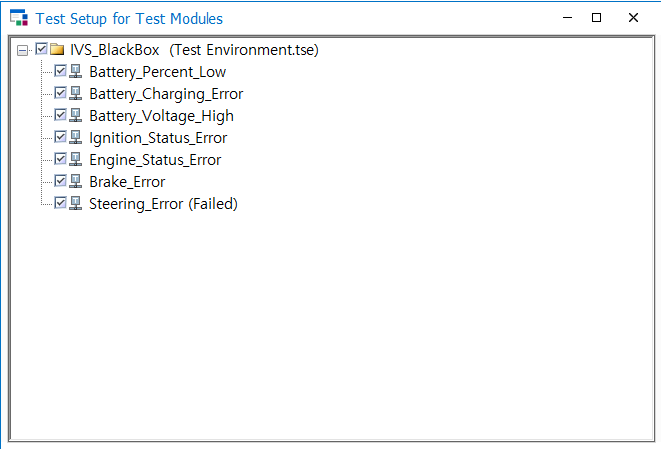
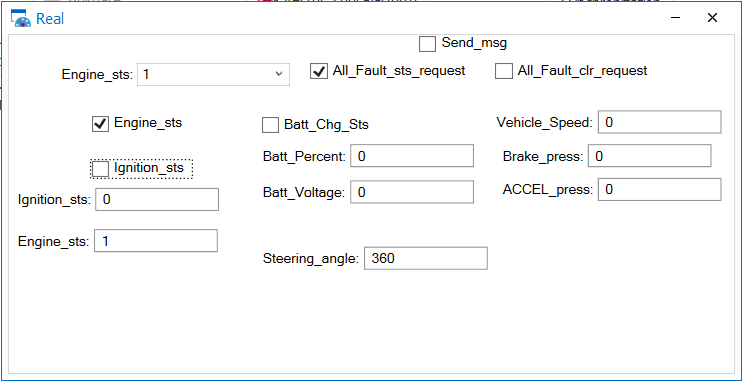

# HL만도 & HL클레무브 IVS Black Box Validation Project

<p align="center">
  
</p>

<p align="center">
  CANoe 기반 환경 구축, CANdb 설계, CAPL 자동화 테스트를 통해<br>
  IVS 제어기의 CAN/UDS 요구사항과 Fault 관리 로직을 검증한 프로젝트
</p>

---

## Overview

이 프로젝트는 **IVS 제어기**를 대상으로 CAN 기반 입력/출력 요구사항, UDS 요청/응답, 그리고 고장 상태 전이 및 삭제 로직을 검증한 **Black Box Testing 프로젝트**입니다. 공식 프로젝트명은 **자동화 테스팅을 통한 Black Box Testing 및 검증의 이해**이며, 프로젝트에서는 BMS, ENG, STR, BRK ECU에서 전달되는 메시지와 UDS 요청에 대한 IVS의 동작을 요구사항 기준으로 검증했습니다. 또한 Fault Detection, Recovery, Deleted(0) / Fixed(1) / Faulted(2) 상태 관리와 IGN Off→On 전환 50회 발생 시 고장 삭제 조건까지 포함한 상태 기반 검증을 수행했습니다.

프로젝트의 핵심은 단순히 테스트를 수행하는 데 그치지 않고, **요구사항 해석 → 테스트 환경 구축 → 테스트 케이스 설계 → 정적/동적 검증 → 결함 분석 및 개선 방향 제안**까지 전체 흐름을 수행한 점입니다.

---

## Project Summary

- **Official Project Name**: 자동화 테스팅을 통한 Black Box Testing 및 검증의 이해
- **Target ECU**: IVS
- **Period**: 2026.03.19 ~ 2026.03.23
- **Validation Method**: Requirement-Based Black Box Testing
- **Tools**: CANoe, CANdb (DBC), CAPL
- **Protocols**: CAN, UDS

---

## What I Did

- CANoe 기반 검증 환경 구성
- IVS 외 ECU(BMS, ENG, STR, BRK, UDS) network node 구성
- IVS 송수신 메시지 정의를 위한 CANdb 작성
- Panel / Trace 기반 수동 검증 환경 구성
- 자동화 테스트 환경 및 모듈 생성
- 요구사항 기반 테스트 케이스 설계
- 함수 및 파라미터를 조정하는 방식의 테스트 케이스 재사용 구조 적용
- 정적/동적 테스트 수행 및 결함 분석
- 결함 원인 추론 및 수정 방향 제안

---

## Validation Scope

본 프로젝트에서는 IVS 제어기의 입력 해석, 응답 메시지 송신, 고장 상태 관리 로직을 중심으로 다음 항목들을 검증했습니다.

- **CAN 입력 메시지 해석 검증**
  - **BMS**: Batt_Percent, Batt_Chg_Sts, Batt_Voltage
  - **ENG**: Ignition_sts, Engine_sts
  - **STR**: Steering_angle
  - **BRK**: Brake_press, ACCEL_press, Vehicle_Speed

- **UDS 요청/응답 검증**
  - 소프트웨어 버전 요청
  - 전체 고장 상태 요청
  - 전체 고장 삭제 요청
  - 응답 후 10ms 이내 동일 고장 상태 요청 무시 조건 검증

- **Fault 관리 로직 검증**
  - Fault Detection
  - Fault Recovery
  - Deleted / Fixed / Faulted 상태 전이
  - IGN Off → On 50회 전환 시 고장 삭제 조건
  - 경계값 및 타이밍 조건 검증

---

## Test Environment

<p align="center">
  
</p>

검증 환경은 IVS를 중심으로 주변 ECU를 CANoe network node로 구성하고, IVS 제어기에서 송수신하는 CAN 메시지에 대해 CANdb를 작성하는 방식으로 구축했습니다. 이후 수동 테스트를 위한 Panel과 CAN 메시지 추적을 위한 Trace 창을 구성했으며, 반복 검증이 필요한 항목은 자동화 테스트 환경과 모듈을 생성해 검증했습니다.

<table>
  <tr>
    <td align="center">
      <br>
      <sub><b>Automated Test Environment</b></sub>
    </td>
    <td align="center">
      <br>
      <sub><b>Panel and Trace</b></sub>
    </td>
  </tr>
</table>

- **Network Configuration**: IVS, BMS, ENG, STR, BRK, UDS ECU 구성
- **CAN Database**: IVS 송수신 CAN 메시지 정의
- **Manual Validation**: Panel을 통한 입력 제어, Trace를 통한 메시지 확인
- **Automated Validation**: 자동화 테스트 환경 및 모듈 구성, 반복 검증 항목 자동화

---

## Test Strategy

본 프로젝트에서는 **정적 테스팅**과 **동적 테스팅**을 함께 수행했습니다. 정적 테스팅에서는 요구사항 문서, 메시지 정의, Signal Description 간의 불일치를 검토했고, 동적 테스팅에서는 실제 입력 조건을 구성해 Fault 검출/회복, 상태 전이, 경계값, 타이밍 동작을 검증했습니다. 또한 기본적인 테스트 케이스를 먼저 작성한 뒤, 각 페이지의 요구사양에 맞춰 함수와 파라미터를 수정해 재사용하는 방식으로 테스트를 확장했습니다.

---

## Representative Testing & Defects

본 프로젝트에서는 정적 테스팅을 통해 **명세와 정의 간 충돌**을, 동적 테스팅을 통해 **구현 로직과 실제 동작 간 불일치**를 확인했습니다. README에서는 각각 대표 예시 1개씩을 중심으로 정리했습니다.

### Static Testing Example

<p align="center">
  
</p>

`Ignition_sts`는 Description상 `Off / On / Error`의 3가지 상태를 표현해야 하지만, 메시지 정의에서는 1bit로 설정되어 있어 모든 상태를 표현할 수 없는 문제가 있었습니다. 이 사례는 요구사항 해석과 Signal 정의 간 불일치를 정적 테스팅 단계에서 식별한 대표 예시입니다. 이에 따라 해당 signal의 length를 최소 2bit로 수정하는 방향을 도출했습니다.

### Dynamic Testing Example

<p align="center">
  
</p>

동적 테스팅에서는 `Batt Percent = 15%` 조건에서 Fault Level 2가 검출되어야 했지만, 실제 검증 결과 해당 값에서만 검출되지 않는 현상을 확인했습니다. 반면 15%를 초과하는 구간에서는 정상적으로 검출되어, 비교 연산에서 경계 포함 조건이 누락된 문제로 분석했습니다. 이에 따라 `<` 대신 `<=`로 수정하는 방향을 제안했습니다.

### Additional Findings

- `IGN 50 Cycle on/off` 조건이 기대값인 50회가 아니라 49회에서 동작하는 오프바이원 문제
- `Batt Percent = 80%`에서만 Fault Level 2가 검출되지 않는 경계값 포함 조건 누락 문제
- `IGN == 1 && Engine == 1` 조건에서만 검출되어야 하는 Fault가 Pre-condition 미충족 상황에서도 검출되는 오검출 문제
- Batt Voltage 검출/회복 조건이 요구사항과 다르게 동작하는 문제

---

## Key Takeaways

이 프로젝트를 통해 단순히 테스트를 수행하는 수준을 넘어, **요구사항을 직접 해석하고, 테스트 환경을 구성하고, 테스트 케이스를 설계하고, 실제 결과를 근거로 결함 원인을 추론하는 경험**을 할 수 있었습니다. 특히 signal length, 값 표현 방식, Description 불일치 같은 정적 결함과 Batt Percent 15%, 80%, IGN 50 Cycle, Ignition/Engine/Brake/Steering 관련 로직 문제 같은 동적 결함을 직접 확인하며, 요구사항 기반 검증의 중요성을 체감했습니다.

---

## Repository Structure

```text
ivs-blackbox-validation/
├─ README.md
├─ docs/
├─ canoe/
├─ capl/
├─ requirements/
├─ reports/
└─ assets/
   └─ images/
